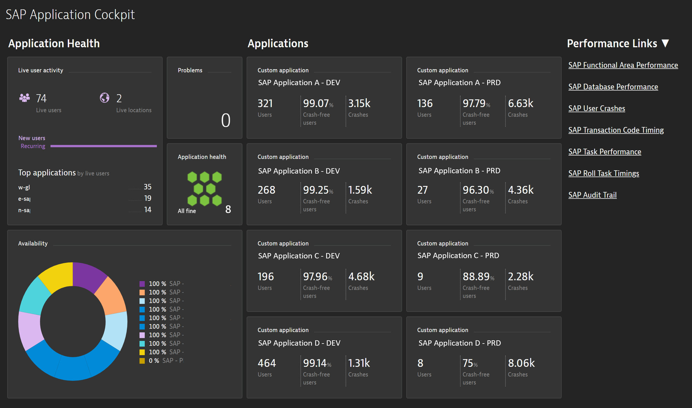
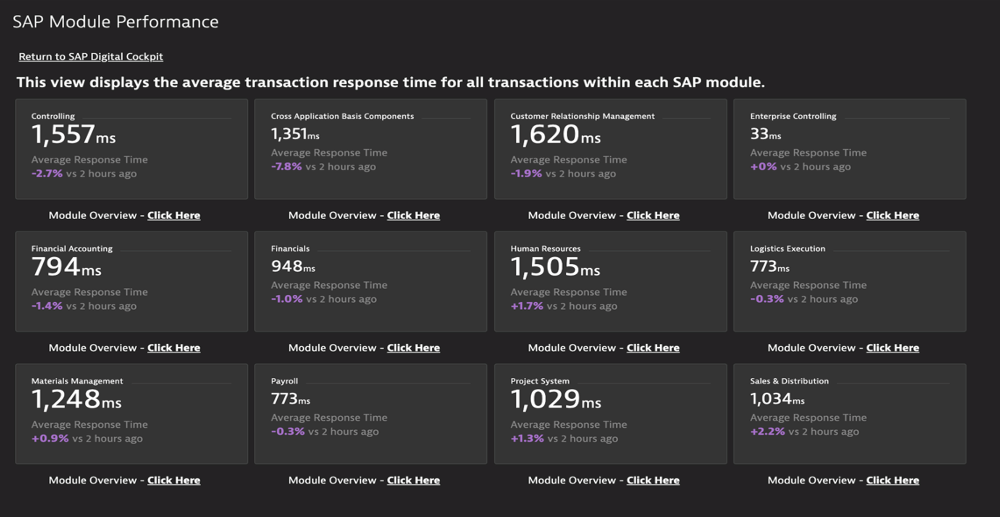
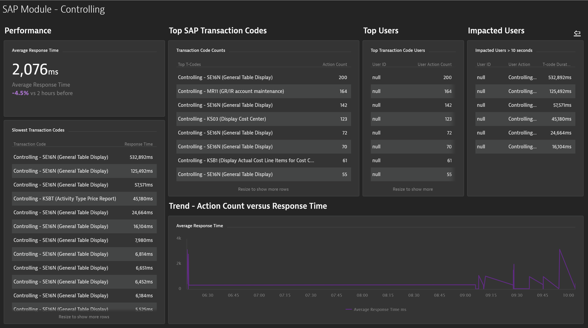
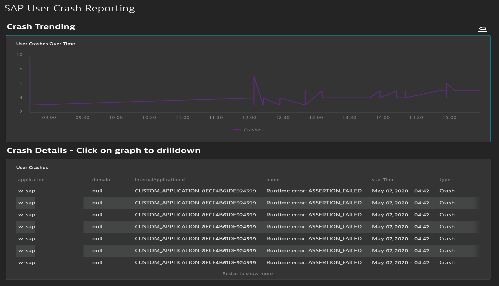
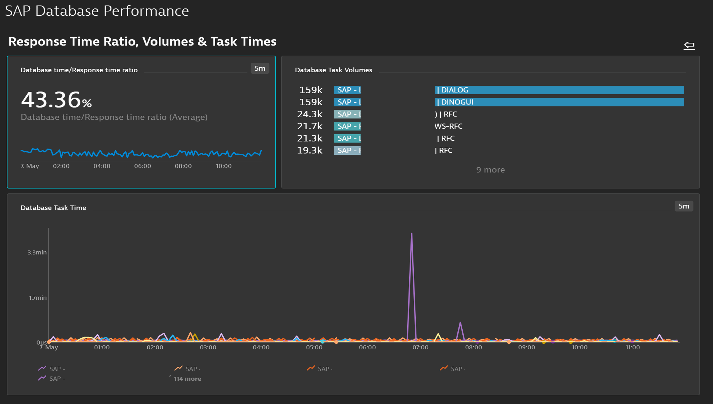
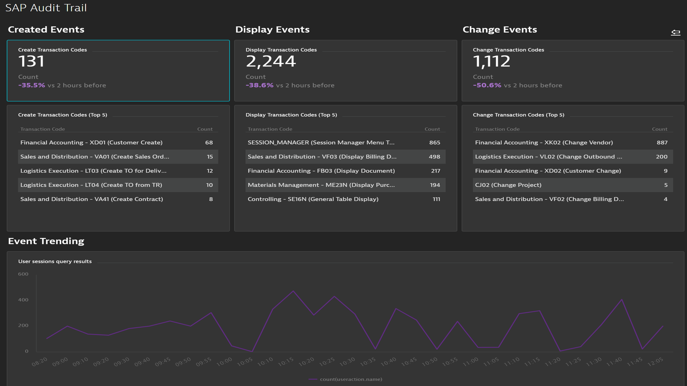

# SAP-extension-dashboards

These dashboards are used for the Dynatrace SAP extension. The minimum required version of the SAP extension is 1.126. Tagging SAP custom devices and applications was used to configure the dashboards. It's best to have a management zone for each SAP application. That will allow for multiple application dashboards to utilize the same dashboard set.

<h2>SAP Application Cockpit</h2>
The SAP Application Cockpit is the main dashboard for the SAP Extension. It displays the overall health of the SAP application environments that are monitored. The "Performance Links" will provide additional areas for SAP performance.

<h2>SAP Functional Area Performance</h2>
The SAP Functional Area Performance will display response time performance for each functional area (SAP module). Current performance can be compared to previous time frames to see which way the performance is trending.

<h2>SAP Module</h2>
The SAP Module will display peformance for a specific functional area (module). Response times, slowest t-codes, top t-codes, impacted users and most frequently used t-codes are reported.

<h2>SAP User Crash Reporting</h2>
The crash reporting dashboard will identify all user crashes. These are based on runtime errors and drilldown capabilites provide short dump and/or stack traces of the crash.

<h2>SAP Database Performance</h2>
The database performance dashboard will detail response time ratios. Tiles will show volumes and database task timings.

<h2>SAP Audit Trail</h2>
The SAP aduit trail with show create, display and change events. Trending these events can help determine an increase in these events and how they contribute to performance or security issues with the number of executions outside of the previous trends.

## Issues & Enhancement:
For any issues or requests for enhancement, please open an Issue on the GitHub repo: https://github.com/popecruzdt/BizOpsConfiguratorPacks/issues
